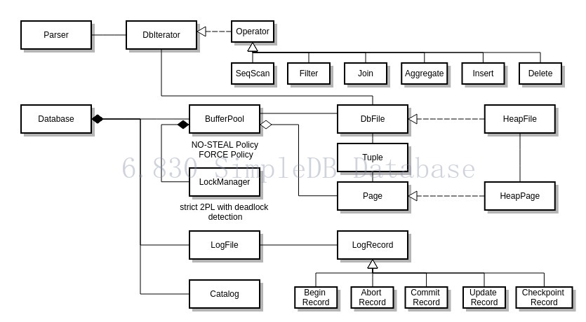

# SimpleDB Database System

The lab assignments of [MIT course 6.830](http://ocw.mit.edu/courses/electrical-engineering-and-computer-science/6-830-database-systems-fall-2010/assignments/): 
implementation of a tiny database management system using the given code skeleton.

## Architecture

## Build and Test

To build, type in the root directory:

	ant

To run unit tests:

	ant test:

To run system tests:

	ant systemtest

To clean up executable files:

	ant clean

To create a JAR file in dist/:

	ant dist

To load a schema file and start the interpreter, use the following command:

	java -jar dist/simpledb.jar parser dblp_data/dblp_simpledb.schema

